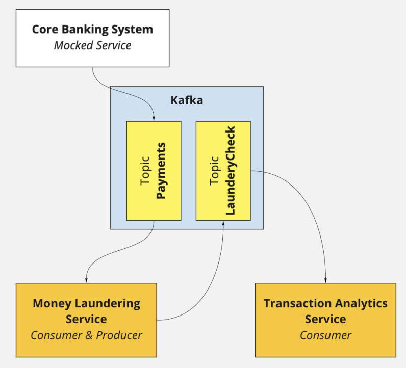

# Getting Started

This playground implements three simple services that communicate through kafka. The communication is shown in the image
below.



## Run kafka and every service with docker-compose

```bash
# Running kafka, zookeeper, banking-service, money-laundering-service and transaction-analysis-service
./run.sh

# OR

# Running kafka, zookeeper, banking-service, money-laundering-service and transaction-analysis-service
docker-compose down
docker-compose up --build
```


